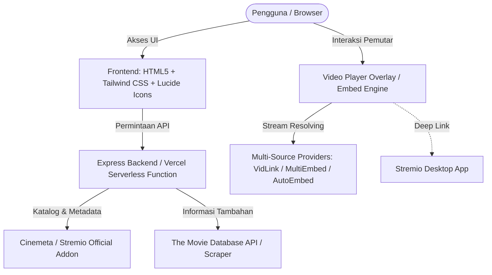

# 🎬 YukNonton - Modern Web Streaming Platform

<div align="center">

**Aplikasi Web Streaming Film & Serial TV Modern, Cepat, dan Responsif**

[](https://vercel.com/new/clone?repository-url=https://github.com/okjamijia-web/streaming-project)

[](https://nodejs.org/)
[](https://expressjs.com/)
[](https://tailwindcss.com/)
[](https://vercel.com)
[](https://opensource.org/licenses/ISC)

[✨ Fitur Utama](#-fitur-utama) • [🏗️ Arsitektur](#%EF%B8%8F-arsitektur-sistem) • [🚀 Menjalankan Lokal](#-cara-menjalankan-secara-lokal) • [☁️ Deploy ke Vercel](#%EF%B8%8F-panduan-deploy-ke-vercel-1-click) • [📡 Dokumentasi API](#-dokumentasi-api)

</div>

---

## 📌 Tentang Proyek

**YukNonton** adalah platform streaming web modern yang dirancang dengan estetika antarmuka sinematik gelap (*dark mode*) yang elegan, responsif di seluruh perangkat (Desktop, Tablet, & Smartphone), dan memiliki integrasi backend katalog real-time serta pemutar streaming multi-provider.

Aplikasi ini dapat dijalankan secara mandiri secara lokal dengan Node.js maupun dideploy tanpa server (*serverless*) secara instan ke [Vercel](https://vercel.com).

---

## ✨ Fitur Utama

- 🎬 **Hero Billboard Sinematik:** Menampilkan cuplikan tayangan teratas hari ini lengkap dengan sinopsis, rating usia, dan tombol pemutar langsung.
- 🔟 **Top 10 Tayangan dengan Navigasi Panah:** Deretan 10 konten terpopuler dengan angka peringkat raksasa (*giant typography rank*) dan tombol geser kiri-kanan (*smooth scroll*).
- 📂 **Filter 10 Kategori Genre Real-Time:** Akses instan ke 10 genre terfavorit:
  - *Adventure, Action, Animation, Comedy, Drama, Thriller, Romance, Science Fiction, Crime, Horror*.
- 📺 **Penjelajah Serial TV & Episode Picker:** Dukungan deteksi otomatis film vs serial, lengkap dengan pemilih season, deskripsi tiap episode, dan thumbnail preview.
- 🔖 **Daftar Saya (My List / Watchlist):** Simpan film & serial favorit Anda ke penyimpanan browser lokal (*LocalStorage*) tanpa perlu registrasi akun.
- 🔍 **Pencarian Cepat (Instant Debounce Search):** Cari judul apa pun dari katalog global Cinemeta dan TMDb dalam hitungan milidetik.
- ⚡ **Multi-Provider Streaming Resolver:** Mendukung resolver otomatis ID IMDb/TMDb ke berbagai server pemutar (VidLink HD/4K, MultiEmbed, AutoEmbed) serta tautan langsung aplikasi desktop Stremio.
- 🛡️ **Adblocker Ready:** Optimal digunakan bersama peramban berbasis pemblokir iklan (seperti Brave Browser atau ekstensi uBlock Origin) untuk pengalaman menonton tanpa gangguan iklan.
- 📱 **Desain Sepenuhnya Responsif:** Tampilan navbar, billboard, modal detail, dan pemutar video yang disesuaikan untuk layar smartphone maupun monitor layar lebar.

---

## 🏗️ Arsitektur Sistem



---

## 🛠️ Teknologi yang Digunakan

| Komponen | Teknologi | Keterangan |
| :--- | :--- | :--- |
| **Frontend** | Vanilla JavaScript (ES6+), Tailwind CSS (CDN), Lucide Icons | Ringan, cepat tanpa overhead framework besar |
| **Video Engine** | HLS.js & Multi-Source Iframe Embedder | Streaming video adaptif dengan fallback multi-server |
| **Backend** | Node.js, Express.js | REST API, streaming resolver, dan katalog parser |
| **Deployment** | Vercel Serverless Functions (`/api/index.js`) | Auto-deploy dari commit GitHub dengan skalabilitas tinggi |
| **Media Server (Opsional)** | Docker Compose (Jellyfin, Radarr, Sonarr) | Tersedia konfigurasi siap pakai untuk home server |

---

## 🚀 Cara Menjalankan Secara Lokal

### 1. Prasyarat
- Pastikan [Node.js](https://nodejs.org/) (versi 18 ke atas) telah terpasang di komputer Anda.
- Git terpasang di komputer Anda.

### 2. Kloning Repository & Instalasi
```bash
# Clone repository
git clone https://github.com/okjamijia-web/streaming-project.git

# Masuk ke direktori proyek
cd streaming-project

# Install dependensi
npm install
```

### 3. Menjalankan Server
```bash
npm start
```
Buka browser dan navigasi ke:
👉 **[http://localhost:5050](http://localhost:5050)**

---

## ☁️ Panduan Deploy ke Vercel (1-Click)

Aplikasi ini sudah dilengkapi dengan konfigurasi `vercel.json` dan adapter serverless di `api/index.js`.

### Langkah-langkah:
1. **Fork atau Clone** repository ini ke akun GitHub pribadi Anda.
2. Buka [Vercel Dashboard](https://vercel.com/dashboard) dan klik **Add New...** -> **Project**.
3. Pilih repository **`streaming-project`** Anda.
4. Biarkan pengaturan build default (`npm start` / Node.js standard).
5. Klik tombol **Deploy**.
6. Dalam 30–60 detik, situs web YukNonton Anda akan aktif secara publik dengan domain gratis `*.vercel.app`!

> [!TIP]
> Setiap kali Anda melakukan `git push` ke branch `main`, Vercel akan secara otomatis melakukan pembaruan (*auto-deploy*) tanpa downtime.

---

## 📡 Dokumentasi API

Server Express menyediakan beberapa endpoint REST API yang digunakan oleh antarmuka frontend:

| Endpoint | Method | Parameter Query / Path | Deskripsi |
| :--- | :--- | :--- | :--- |
| `/api/catalog` | `GET` | `refresh=true` (opsional) | Mengambil data billboard unggulan, Top 10 Indonesia, dan baris kategori |
| `/api/genre/:genre` | `GET` | `:genre` (*Adventure, Action, dll.*) | Mengambil katalog film & serial khusus genre tertentu |
| `/api/detail/:id` | `GET` | `:id` (IMDb/TMDb ID), `type=movie|series` | Mengambil data lengkap sinopsis, rating, cast, season, dan daftar episode |
| `/api/search` | `GET` | `q=:kata_kunci` | Melakukan pencarian judul film atau serial secara real-time |
| `/api/stream/:type/:id` | `GET` | `:type`, `:id`, `season=1`, `episode=1` | Menyediakan URL stream multi-provider (VidLink, AutoEmbed, MultiEmbed) |
| `/api/subtitles/:lang` | `GET` | `:lang` (`id` / `en`) | Menyediakan file subtitle WebVTT |

---

## 📁 Struktur Folder

```text
streaming-project/
├── api/
│   └── index.js              # Serverless entrypoint untuk Vercel
├── public/
│   ├── css/
│   │   └── style.css         # Styling kustom (number fonts, scrollbar, vignette)
│   ├── js/
│   │   └── app.js            # Controller frontend (katalog, navigasi, player)
│   └── index.html            # Markup antarmuka utama YukNonton
├── server/
│   ├── index.js              # Server Express utama (REST API)
│   ├── stremio.js            # Provider resolver Stremio & multi-embed
│   └── tmdb.js               # Service katalog Cinemeta & metadata scraper
├── docker-compose.yml        # Konfigurasi opsional Jellyfin, Radarr, & Sonarr
├── package.json              # Dependensi & script Node.js
├── vercel.json               # Konfigurasi routing serverless Vercel
└── README.md                 # Dokumentasi proyek
```

---

## 🐳 Media Server Lokal (Opsional)

Bagi Anda yang ingin mengintegrasikan aplikasi dengan media server pribadi di rumah (*home server*), file `docker-compose.yml` telah disediakan untuk menjalankan:
- **Jellyfin:** Pemutar media streaming pribadi (Port `8096`).
- **Radarr:** Manajemen otomatis koleksi film (Port `7878`).
- **Sonarr:** Manajemen otomatis serial TV & Anime (Port `8989`).

Jalankan stack media server dengan perintah:
```bash
docker compose up -d
```

---

## 📄 Lisensi

Proyek ini dirilis di bawah lisensi [ISC License](https://opensource.org/licenses/ISC). Bebas digunakan, dipelajari, dan dikembangkan untuk keperluan non-komersial dan edukasi.
